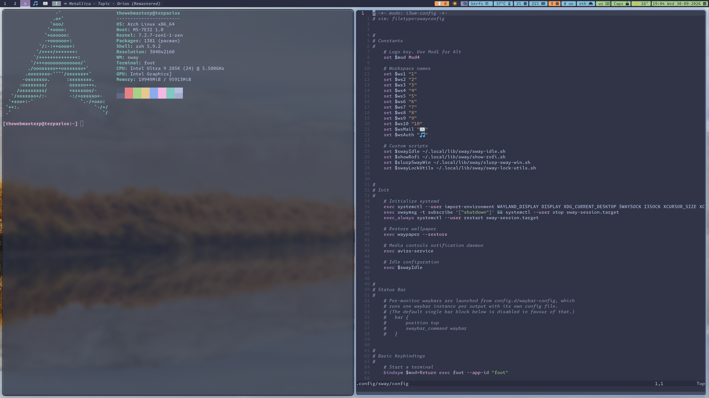

# dotfiles

An Arch Linux + [SwayFX](https://github.com/WillPower3309/swayfx) desktop, Catppuccin-themed end to end, with **one-command dark/light switching across every app** and a **declarative package list** that rebuilds the whole environment on a fresh machine. Managed as plain git with `$HOME` as the work tree — no symlinks, no framework.

| Catppuccin Mocha (dark) | Catppuccin Frappé (light) |
|---|---|
|  |  |

## Highlights

- **Whole-desktop theme switching** — one [darkman](https://darkman.whynothugo.nl/) toggle re-themes Sway, Waybar, foot, Neovim, tmux, rofi, mako, swaylock, GTK3, and Qt. Running apps update live: foot via `SIGUSR1`, Neovim over RPC, Sway/Waybar reload.
- **Tracked configs never churn** — theme hooks write only to an untracked state dir (`~/.local/state/theme/`) that the static configs `include`/`source`. Toggling themes produces zero git diff.
- **Declarative packages** — [metapac](https://github.com/ripytide/metapac) owns the package list; every entry in [`groups/shared.toml`](.config/metapac/groups/shared.toml) says which config needs it. [`bootstrap-packages`](.local/bin/bootstrap-packages) provisions a fresh Arch install, [`pkgsync`](.local/bin/pkgsync) keeps it converged.
- **Three-tier config layering** — public (this repo) → private (separate repo, same work tree) → local (untracked). The same tiers exist for packages (`shared.toml`/`private.toml`/`local.toml`) and shell snippets (`~/.zshrc.d/`, `~/.zprofile.d/`).
- **40 ms zsh startup** (measured, warm cache) with mise, zoxide, fzf+fd, autosuggestions, syntax highlighting, substring history search, and a 120k-entry shared history — no plugin manager, everything from pacman.
- **SwayFX niceties** — blur, rounded corners, shadows, per-monitor Waybar, six screenshot bindings (region/window × clipboard/disk/annotate), staged idle→lock→suspend, systemd `sway-session.target` integration.
- **Waybar with hand-rolled widgets** — water-intake counter, dark/light toggle, btrfs health, weather, pending pacman updates; CPU/memory/network/bluetooth modules click through to `htop`/`nmtui`/`bluetui`/`netscanner` in a floating terminal.
- **Lean Neovim** — lazy.nvim with a deliberately small plugin set (catppuccin, snacks.nvim, treesitter, lspconfig+mason, blink.cmp, which-key) plus [opencode.nvim](https://github.com/NickvanDyke/opencode.nvim) wired to a running agent.

## Layout

| Path | What lives there |
|---|---|
| [`.config/sway/`](.config/sway/) | SwayFX config; `config.d/` holds theme includes, per-monitor Waybar launch, clipboard manager |
| [`.config/waybar/`](.config/waybar/) | Bar config + Catppuccin palettes ([widget scripts](.local/lib/waybar/)) |
| [`.local/lib/sway/`](.local/lib/sway/) | Idle/lock chain, rofi launchers, cliphist picker, display presets, screenshot geometry |
| [`.local/share/dark-mode.d/`](.local/share/dark-mode.d/), [`light-mode.d/`](.local/share/light-mode.d/) | darkman theme hooks, one script per app |
| [`.config/foot/`](.config/foot/), [`tmux/`](.config/tmux/), [`mako/`](.config/mako/), [`rofi/`](.config/rofi/), [`swaylock/`](.config/swaylock/) | Themed app configs (each includes its file from `~/.local/state/theme/`) |
| [`.config/nvim/`](.config/nvim/) | Neovim: `init.lua` + `lua/{options,keymaps,plugins,theme}.lua` |
| [`.zshrc`](.zshrc), [`.zprofile`](.zprofile) | Shell; both source `*.d/` dirs for private/machine-local snippets |
| [`.config/metapac/`](.config/metapac/) | Declarative package groups |
| [`.local/bin/`](.local/bin/) | `swm` (Sway launcher), `wsudo` (GUI-as-root), `pkgsync`, `bootstrap-packages`, the `git-shared`/`git-private` repo wrappers |

## How the repo works

Two bare repositories share `$HOME` as their work tree:

| Wrapper | Repo | Contents |
|---|---|---|
| [`git-shared`](.local/bin/git-shared) | this one (GitHub) | public-safe desktop/WM/shell config |
| [`git-private`](.local/bin/git-private) | self-hosted | mail/calendar stack, anything personal |

Each wrapper is a single `exec`:

```bash
exec git --git-dir="$DIR/.gitshared" --work-tree="$HOME" \
	-c core.excludesFile="$DIR/gitignore-shared" "$@"
```

`core.excludesFile` points git at the repo's own ignore source ([`gitignore-shared`](.local/share/gitReposDirs/gitignore-shared)): **deny-all (`*`), then explicit `!` whitelists** (parent dirs first, then the file). A file is tracked only if deliberately opted in, and neither repo sees the other's rules. Day to day it's plain git behind an alias: `gits status`, `gits add`, `gits commit`.

## Adopting it

> **This is a personal config, not a distribution.** Read what you're about to run. It assumes Arch Linux, and `bootstrap-packages` installs ~90 packages including AUR builds (SwayFX among them).

On a fresh Arch install:

```bash
git clone --bare https://github.com/thewebmasterp/dotfiles.git ~/.local/share/gitReposDirs/.gitshared
cd ~
git --git-dir ~/.local/share/gitReposDirs/.gitshared --work-tree "$HOME" checkout
~/.local/bin/bootstrap-packages   # pacman prereqs → yay → metapac → everything else
```

If `checkout` complains about existing files (a distro-default `.zshrc`, say), move them aside and re-run. Log in on a TTY and start the session with `swm`; from then on `gits` manages config and `pkgsync` converges packages.

### …or just take the parts you want

Everything is plain files at the paths listed [above](#layout), so extraction is copy-paste:

- **The theme-switching system**: copy `.local/share/{dark,light}-mode.d/`, install `darkman`, and make each app's config include its file from `~/.local/state/theme/` the way [`foot.ini`](.config/foot/foot.ini) (`include`), [`tmux.conf`](.config/tmux/tmux.conf) (`source-file`), and [`sway/config`](.config/sway/config) (`include`) do. Hooks are independent — take only the apps you use.
- **The bare-repo + whitelist mechanism**: copy `.local/bin/git-shared` and start your own `gitignore-shared` from mine (keep the leading `*`). It's three lines; no symlinks, no copying, no framework.
- **Declarative packages**: `.config/metapac/` + `.local/bin/pkgsync` + `bootstrap-packages` work standalone; the annotation-per-package convention is the useful part.
- **Single widgets** (`.local/lib/waybar/*.sh`), the [screenshot bindings](.config/sway/config), or the [zsh setup](.zshrc) — all self-contained.

## What's *not* here

- The **private overlay**: mail/calendar/contacts stack and other personal config. This repo alone still yields a complete working desktop.
- **Hardware-specific config**: display profiles and per-machine packages live in the private/local tiers — supply your own.
- **A plugin manager or framework** for zsh or tmux — plugins come from pacman and are sourced directly.

## License

[MIT](LICENSE).
